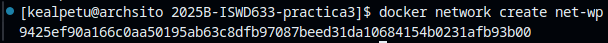
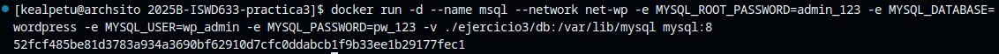
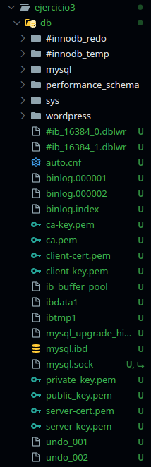
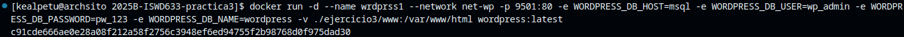

## Esquema para el ejercicio

### Crear red net-wp
# COMPLETAR CON EL COMANDO
### Para que persista la información es necesario conocer en dónde mysql almacena la información.

# COMPLETAR LA SIGUIENTE ORACIÓN. REVISAR LA DOCUMENTACIÓN DE LA IMAGEN EN https://hub.docker.com/
En el esquema del ejercicio carpeta del contenedor (a) es (COMPLETAR CON LA RUTA)

Ruta carpeta host: .../ejercicio3/db

### ¿Qué contiene la carpeta db del host?
# COMPLETAR CON LA RESPUESTA A LA PREGUNTA

Contiene todas las configuraciones y las bases de datos creadas por mysql.

### Crear un contenedor con la imagen mysql:8  en la red net-wp, configurar las variables de entorno: MYSQL_ROOT_PASSWORD, MYSQL_DATABASE, MYSQL_USER y MYSQL_PASSWORD
# COMPLETAR CON EL COMANDO

### ¿Qué observa en la carpeta db que se encontraba inicialmente vacía?
# COMPLETAR CON LA RESPUESTA A LA PREGUNTA

Ahora se escribieron todos los archivos y configuraciones necesarios para que MySQL los utilice fuera del contenedor.

### Para que persista la información es necesario conocer en dónde wordpress almacena la información.
# COMPLETAR LA SIGUIENTE ORACIÓN. REVISAR LA DOCUMENTACIÓN DE LA IMAGEN EN https://hub.docker.com/
En el esquema del ejercicio la carpeta del contenedor (b) es (COMPLETAR CON LA RUTA)

Ruta carpeta host: .../ejercicio3/www

### Crear un contenedor con la imagen wordpress en la red net-wp, configurar las variables de entorno WORDPRESS_DB_HOST, WORDPRESS_DB_USER, WORDPRESS_DB_PASSWORD y WORDPRESS_DB_NAME (los valores de estas variables corresponden a los del contenedor creado previamente)
# COMPLETAR CON EL COMANDO

### Personalizar la apariencia de wordpress y agregar una entrada

### Eliminar el contenedor y crearlo nuevamente, ¿qué ha sucedido?

# COMPLETAR CON LA RESPUESTA A LA PREGUNTA

Todos los datos se mantienen, las configuraciones de tema y las entradas, todo sin interrumpir el sistema en algun momento.

